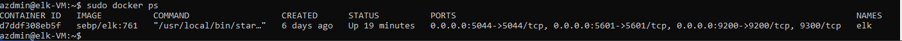
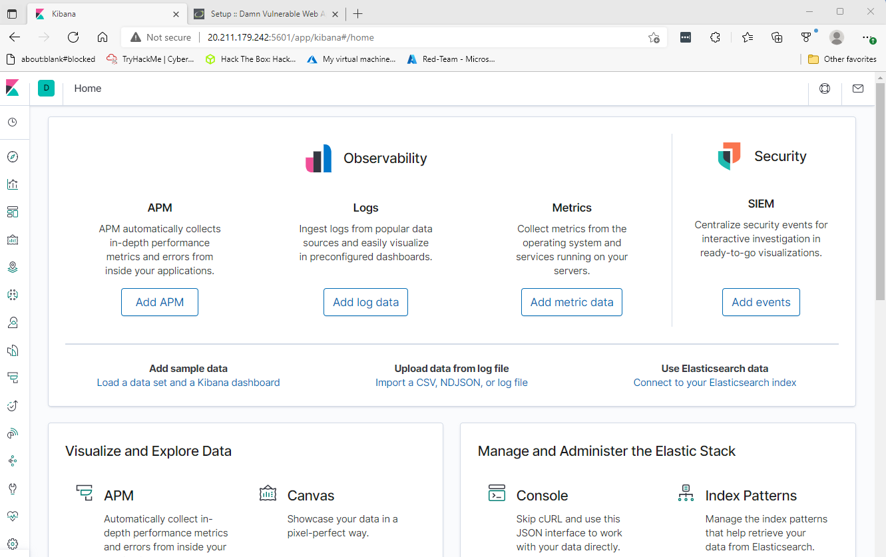
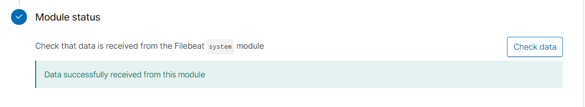
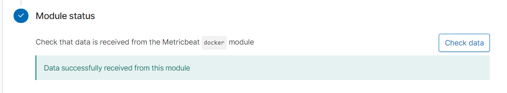

# ELK-Project
ELK Project 1

## Automated ELK Stack Deployment

The files in this repository were used to configure the network depicted below.

These files have been tested and used to generate a live ELK deployment on Azure. They can be used to either recreate the entire deployment pictured above. Alternatively, select portions of the playbook files may be used to install only certain pieces of it, such as Filebeat.

The playbook files are following:
* [elk.yml](Ansible/elk.yml)
* [host.yml](Ansible/host.yml)
* [pentest.yml](Ansible/pentest.yml)
* [filebeat-config.yml](Ansible/filebeat-config.yml)
* [filebeat-playbook.yml](Ansible/filebeat-playbook.yml)
* [metricbeat-config.yml](Ansible/metricbeat-config.yml)
* [metricbeat-playbook.yml](Ansible/metricbeat-playbook.yml)

This document contains the following details:
- Description of the Topologu
- Access Policies
- ELK Configuration
  - Beats in Use
  - Machines Being Monitored
- How to Use the Ansible Build

### Description of the Topology

The main purpose of this network is to expose a load-balanced and monitored instance of DVWA, the D*mn Vulnerable Web Application.

Load balancing ensures that the application will be highly available, in addition to restricting inbound access to the network. Load Balancing plays an important security role as computing moves evermore to the cloud. The off-loading function of a load balancer defends an organization against distributed denial-of-service (DDoS) attacks.

A jump box server is a virtual machine that is used to manage other systems. It is usually security hardened and treated as the single entryway to a server group from within security zone, or inside the overall network. A jump box server is a “bridge” between two trusted networks. The two security zones are dissimilar but both are controlled.

Integrating an ELK server allows users to easily monitor the vulnerable VMs for changes to the configulation and system files.
- Filebeat is used to monitor logs files
- Metricbeat is used to collect operating system and service statistics from monitored VMs

The configuration details of each machine may be found below.

| Name     | Function | IP Address | Operating System |
|----------|----------|------------|------------------|
| Jump Box | Gateway  | 10.0.0.4   | Linux            |
| Web-1    |Web Server| 10.0.0.7   | Linux            |
| Web-2    |Web Server| 10.0.0.8   | Linux            |
| Web-3    |Web Server| 10.0.0.10  | Linux            |
| ELK      |Monitoring| 10.1.0.6   | Linux            |

### Access Policies

The machines on the internal network are not exposed to the public Internet. 

Only the Jumboxprovisioner machine can accept connections from the Internet. Access to this machine is only allowed from the following IP addresses: 114.76.71.96

Machines within the network can only be accessed by each other. Web-1, Web-2 and Web-3 send traffic to the ELK Server.

A summary of the access policies in place can be found in the table below.

| Name     | Publicly Accessible | Allowed IP Addresses | Allowed Ports|
|----------|---------------------|----------------------|--------------|
|Jump Box  | Yes                 |  114.76.71.96        | SSH 22       |
|ELK Server| Yes                 |  114.76.71.96        | HTTP 80      |
|Web-1     | Yes                 |  114.76.71.96        | HTTP 80      |
|Web-2     | Yes                 |  114.76.71.96        | HTTP 80      |
|Web-3     | Yes                 |  114.76.71.96        | HTTP 5601    |

### Elk Configuration

Ansible was used to automate configuration of the ELK machine. No configuration was performed manually, which is advantageous because...
- Build and deployment is performed automatically, consistently and quickly.
- Consistent, rapid configuration and depoloyment of virtual machines ensure all prescribed security meaures can be scripted to minimise attack surfaces while enabling horizontal and elastic scaling by deployment to more or fewer virtual machines in a cluster as required to meet capacity demand.
- As with application deployment, sitewide security policies (such as firewall rules or locking down users) can be implemented along with other automated processes. 
- Facilitates OS and software updates

The playbook implements the following tasks:
- SSH into Jump-Box using : ssh username@jump-box-IP-address 
- Check Ansible container : sudo docker ps
- Lovate the container name : sudo docker container list -a
- Start the container : sudo docker start container_name
- Connect to Ansible container : sudo docker attach container_name
- Add ELK-VM to the Ansible hosts file : nano /etc/ansible/hosts.yml (see: [host.yml](Ansible/host.yml))
- Run: ansible all -m ping
- Create a new Ansible playbook for ELK-VM: nano /etc/ansible/elk.yml (see: [elk.yml](Ansible/elk.yml))
- Run: ansible-playbook /etc/ansible/elk.yml
- SSH from Ansible container to ELK-VM : ssh username@ELK-VM-IP-address
- Run: sudo docker ps

The following screenshot displays the result of running `docker ps` after successfully configuring the ELK instance.

- Verify that we can load the ELK stack server from the browser at http://[ELK-VM-IP-Address]:5601/app/kibana

The following screenshot displays the result of running kibana after successfully configuring the ELK instance

### Target Machines & Beats
This ELK server is configured to monitor the following machines:
  Web-1   10.0.0.7
  Web-2   10.0.0.8
  Web-3   10.0.0.10

We have installed the following Beats on these machines:
  * Filebeat 
  * Metricbeat

These Beats allow us to collect the following information from each machine:
  * Filebeat : Filebeat is a lightweight shipper for forwarding and centralizing log data. Installed as an agent on your servers, Filebeat monitors the log files or locations that you specify, collects log events, and forwards them either to Elasticsearch or Logstash for indexing.
  * Metricbeat : Metricbeat periodically collect metrics from the operating system and from services running on the server. Metricbeat takes the metrics and statistics that it collects and ships them to the output that you specify, such as Elasticsearch or Logstash.

### Using the Playbook
In order to use the playbook, you will need to have an Ansible control node already configured. Assuming you have such a control node provisioned: 

### Install Filebeat
SSH into the control node and follow the steps below:
- From Jum-box ssh into ELK-VM : ssh username@ELK-VM-IP-address
- Run: docker container list -a
- Run: docker start elk
- Copy the playbook files to Ansible Docker Container Run: curl https://gist.githubusercontent.com/slape/5cc350109583af6cbe577bbcc0710c93/raw/eca603b72586fbe148c11f9c87bf96a63cb25760/Filebeat >> /etc/ansible/filebeat-config.yml
- Update the filebeat-config.yml file See: [filebeat-config.yml](Ansible/filebeat-config.yml)
- Save this file in /etc/ansible/files/filebeat-config.yml
- Run: ansible-playbook /etc/ansible/files/filebeat-config.yml
- Download the .deb file Run: curl https://artifacts.elastic.co/downloads/beats/filebeat/filebeat-7.4.0-amd64.deb
- Install the .deb file using the dpkg command Run: dpkg -i filebeat-7.4.0-amd64.deb
- Copy the filebeat-playbook file in a directory called files in the Ansible directory.(/etc/ansible/files/)
- Update the filebeat-playbook. file See: [filebeat-playbook.yml](Ansible/filebeat-playbook.yml)
- Run: ansible-playbook filebeat-playbook.yml.
- Verifying installation, navigate back to the Filebeat installation page on the ELK server GUI: http://ELK-VM-IP-address:5601/app/kibana
- On the same page, scroll to Step 5: Module Status and click Check Data.
- Scroll to the bottom and click on Verify Incoming Data.

The following screenshot displays the result of successfully configuring the filebeat.

### Install Metricbeat
SSH into the control node and follow the steps below:
- From Jum-box ssh into ELK-VM : ssh username@ELK-VM-IP-address
- Run: docker container list -a
- Run: docker start elk
- Copy the playbook files to Ansible Docker Container Run: curl https://gist.githubusercontent.com/slape/58541585cc1886d2e26cd8be557ce04c/raw/0ce2c7e744c54513616966affb5e9d96f5e12f73/metricbeat >> /etc/ansible/metricbeat-config.yml
- Update the metricbeat-config.yml file See: [metricbeat-config.yml](Ansible/metricbeat-config.yml)
- Save this file in /etc/ansible/files/metricbeat-config.yml
- Run: ansible-playbook /etc/ansible/files/metricbeat-config.yml
- Download the .deb file Run: curl https://artifacts.elastic.co/downloads/beats/metricbeat/metricbeat-7.4.0-amd64.deb
- Install the .deb file using the dpkg command Run: dpkg -i metricbeat-7.4.0-amd64.deb
- Copy the metricbeat-playbook file in a directory called files in the Ansible directory.(/etc/ansible/files/)
- Update the mrtricbeat-playbook. file See: [metricbeat-playbook.yml](Ansible/metricbeat-playbook.yml)
- Run: ansible-playbook metricbeat-playbook.yml.
- Verifying installation, navigate back to the Metricbeat installation page on the ELK server GUI: http://ELK-VM-IP-address:5601/app/kibana
- On the same page, scroll to Step 5: Module Status and click Check Data.

The following screenshot displays the result of successfully configuring the metricbeat.

### Useful commands

Check/Start/Connect Ansible container
- sudo docker ps
- sudo docker container list -a
- sudo docker container start Container-Name
- sudo docker container attach Container-Name

Download file from website
- curl https:Link-of-the-file >> Path-of-destination/file-Name
- Example: curl https://gist.githubusercontent.com/slape/58541585cc1886d2e26cd8be557ce04c/raw/0ce2c7e744c54513616966affb5e9d96f5e12f73/metricbeat >> /etc/ansible/metricbeat-config.yml

Update playbook file
- nano Path/fileName.yml
- Example: nano /etc/ansible/files/filebeat-config.yml

